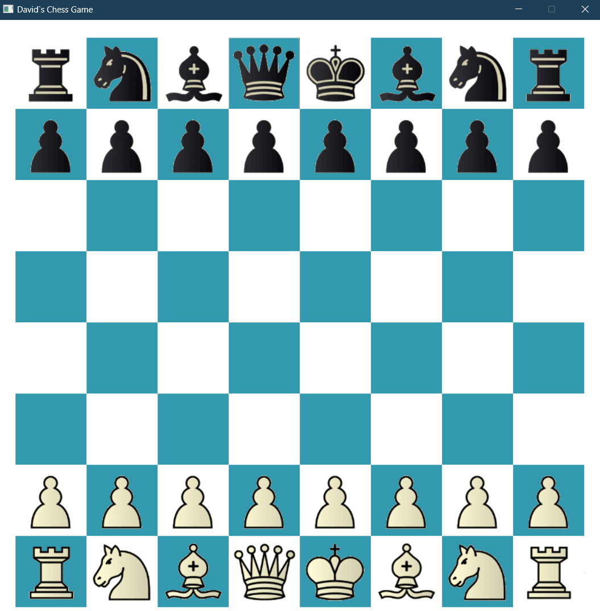
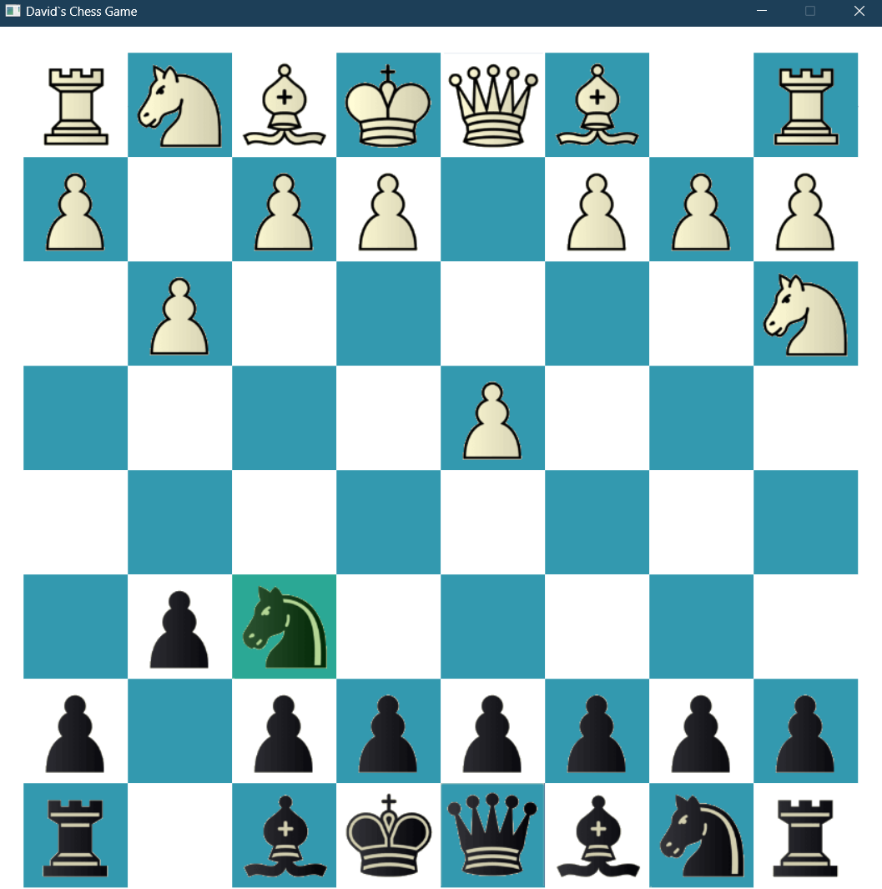

# GUI Chess Engine with JAVAFX

The Chess Engine with GUI project is a Java-based application that implements the standard rules of chess and features a board-flipping feature that rotates the board 180 degrees after each turn. 

The project employs object-oriented programming concepts to handle game logic, board state, and piece positions, and was built in order to familiarize myself with the Java environment, which still is quite new to me, and for the challenge. 
The application features a fully-fledged GUI built with JavaFX, allowing users to interact with the game through a clean and intuitive interface.

## Preview

## Instalation 

To run this application, you will need to have Java 8 or higher installed on your machine. 

Follow these steps to install and run the application:

1. Clone this repository to your local machine: `git clone https://github.com/davidandw190/GUI-Chess-Engine-JAVAFX.git`
2. Open the project in your preferred Java IDE
3. Build and run the application

## Usage

To make a move, click on the piece you want to move and then click on the destination square. If the move is valid, the piece will be moved to the new square. If not, an error message will be displayed.

The board will automatically rotate 180 degrees after each turn to give each player a its correct perspective. 

## Disclaimer

Building this application was a learning process and the methods and resources(images) to build it are not exclusively mine.

There are also quite a few bugs that I am currently working on, so the application is not completely finished.

## Credits

Sources that have helped me a lot in building the project are:

https://www.youtube.com/watch?v=xaJxBsxqkyM&t=5s

https://www.youtube.com/watch?v=U4ogK0MIzqk&t=281s

https://www.youtube.com/watch?v=LT5eMZaGoCs&t=3065s
